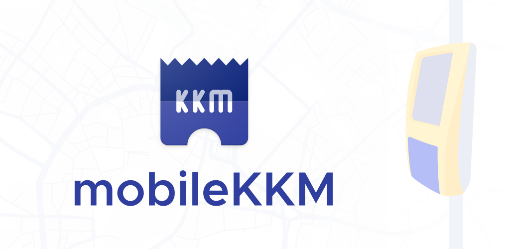

# mobileKKM

A unofficial Android client for the mobile KKM ticketing webapp, with additional features.

Some parts are planned to be built into the app natively (like tickets overview and control), the progress is WIP and can be seen on the master branch during the next few weeks, for now the code needed to be refactored.

